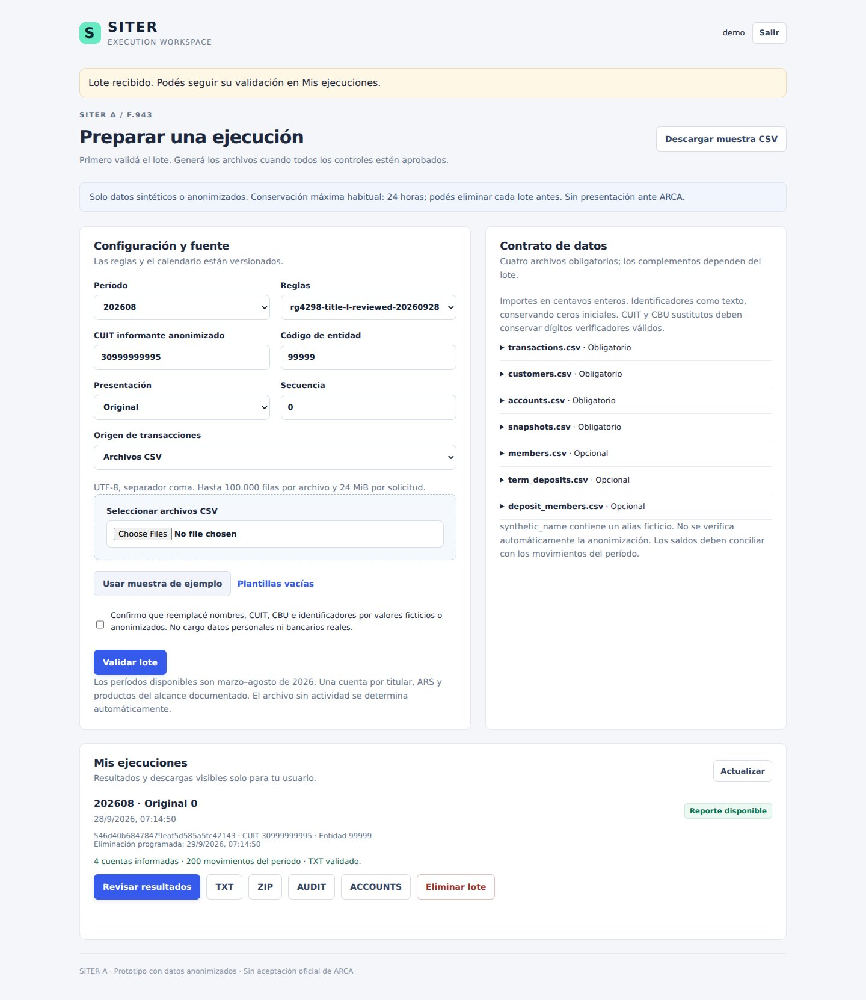
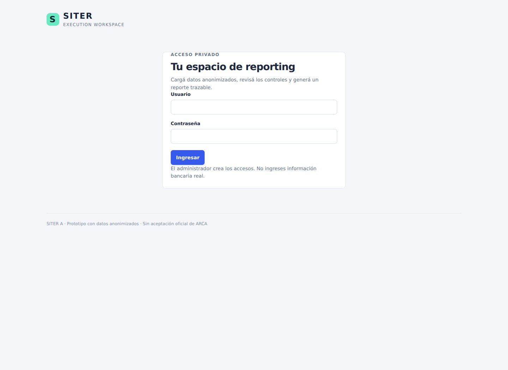
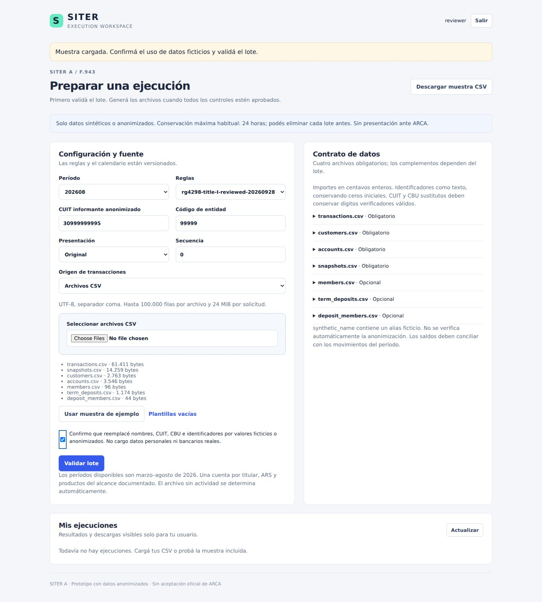
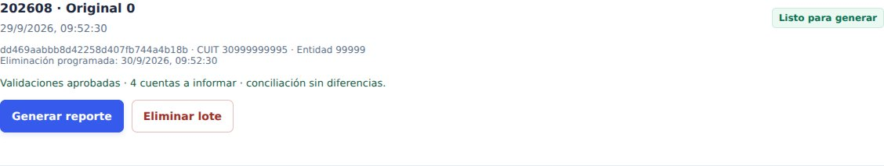
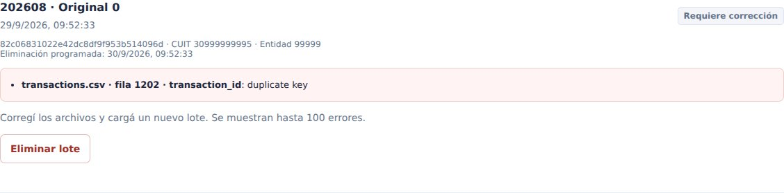
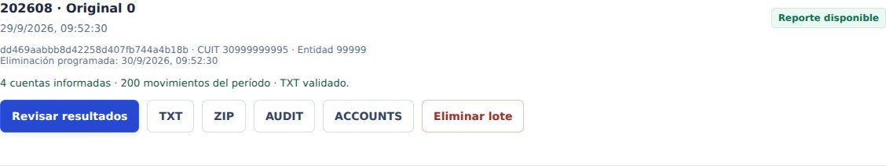
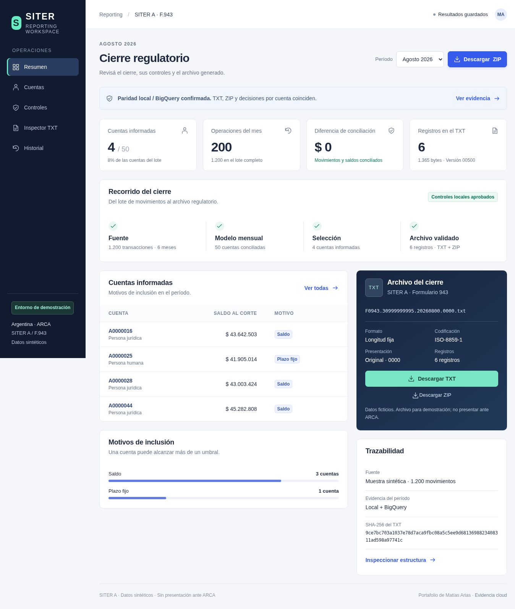
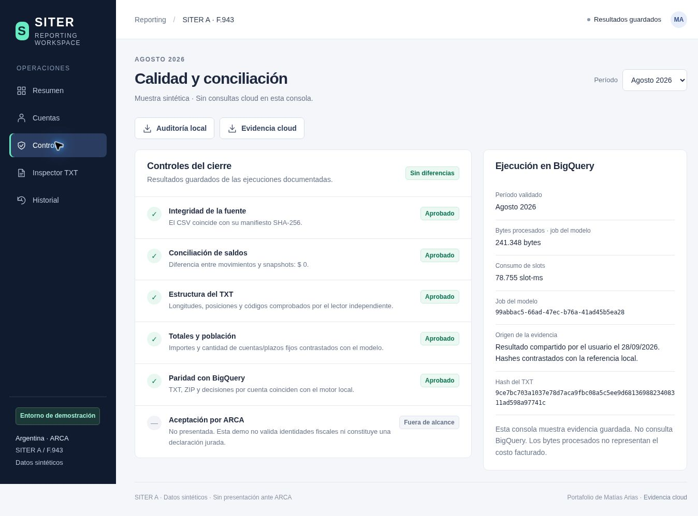
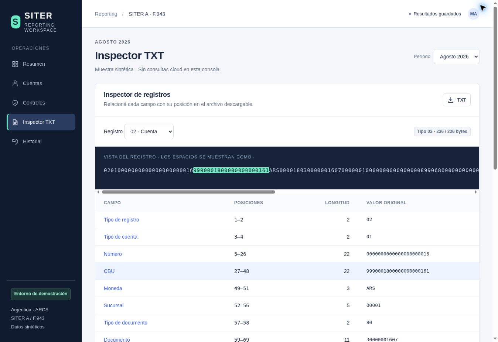

# SITER A / F.943 — Regulatory Reporting Portfolio

**[Open the live demo →](https://siter-reporting.onrender.com/)** · Login required · Anonymized data only

A reproducible finance data pipeline for Argentine account reporting: **synthetic source transactions → monthly account models → eligibility decisions → fixed-width F.943 TXT → independent parser and reconciliation**.

I built this project to mirror a neobank's local regulatory reporting workflow, combining SQL modeling, ETL, regulatory specifications, data quality controls and root-cause analysis in a reproducible pipeline.

## What works

- Configurable deterministic data generator, with a checked-in 1,200-transaction sample and a measured 1,000,000-transaction local benchmark over six months.
- Local Python reference pipeline without third-party dependencies; optional BigQuery ingestion and SQL execution adapter.
- F.943 version `00500` writer for records 01–05, including account representatives and term-deposit representatives.
- Independent fixed-position reader, global uniqueness controls, source-balance reconciliation, business-day balance cutoff, exact money checks, population explanations and reproducible TXT/ZIP hashes.
- Original, replacement (rectificativa) and no-activity files; named according to the published convention.
- Audit report per run, source/code SHA-256 hashes and a GitHub Actions test workflow.

**Validation:** I tested the local pipeline and ran the August 2026 report in BigQuery against the 1,200-transaction source sample. The recorded cloud results match the local reference TXT/ZIP hashes and account decisions, with zero reconciliation difference. The execution summary and its provenance are preserved in `examples/cloud_sample_202608.json`. Cloud validation covers this sample and period; the million-row benchmark was run locally only. The TXT follows the reviewed positional tables for this restricted scenario; it has **not** been accepted by an official ARCA validator. All numeric identities are generated for the demo, may coincide by chance with actual numbers and must never be used in a real submission.

## Interface

I added an authenticated execution workspace for anonymized datasets: CSV upload, schema and business validation, report configuration, background execution, private downloads and run deletion. It reuses the existing account views, controls and TXT inspector for each completed run.

```bash
python3 -m siter.server add-user analyst
python3 -m siter.server serve
```

Open `http://127.0.0.1:8000`. See the [execution guide](docs/execution_console.md) and [CSV contract](docs/csv_contract.md) for access, templates, limits and optional authorized BigQuery imports. The UI processes reports locally; BigQuery SQL execution remains a separate CLI workflow.

The original static sample console is also included in [`web/`](web/README.md). Run `python3 -m http.server 8000 --directory web` and open `http://localhost:8000` to inspect saved sample results without a backend.

## Execution workspace

Authenticated CSV upload, report configuration, data contract and a completed run with private downloads.



## Execution flow

1. Sign in with an individual account.
2. Load the included sample or upload the required anonymized CSV files.
3. Review validation results; correct rejected batches before generating a report.
4. Generate the TXT/ZIP, inspect account decisions and download the audit evidence.
5. Delete the run when finished. Every run belongs to its user.

<details>
<summary>1. Sign-in and 2. Dataset upload</summary>





</details>

<details>
<summary>3. Validation: ready to generate or blocked by errors</summary>





</details>

<details>
<summary>4. Completed execution and downloads</summary>



</details>

## Public deployment

A Docker image definition and a **Render Free** Blueprint are included for an HTTPS demo with private user accounts and temporary storage. Users and run files reset when the free instance restarts; the configured initial login is recreated automatically. Download results before leaving. A separate `render.persistent.yaml` is available for an explicitly selected paid deployment. **The demo is deployed at [siter-reporting.onrender.com](https://siter-reporting.onrender.com/); login is required.** See the [deployment guide](docs/hosting.md) for setup, credentials, costs and verification.

## Saved sample screenshots

Real captures of the August 2026 sample. The console displays saved results and does not query BigQuery.

**Monthly close:** selected accounts, reconciliation, reporting flow and downloadable artifacts.



<details>
<summary>Quality controls and BigQuery evidence</summary>

Local validation and documented cloud parity are shown separately from regulatory acceptance.



</details>

<details>
<summary>Fixed-width TXT inspector</summary>

A selected field is highlighted at its exact positions in an account record.



</details>

## Quick start

Python 3.10+; run commands from the repository root:

```bash
python3 -m unittest discover -s tests -v
python3 -m siter.run --data data/sample --period 202608 --out output
```

A content-addressed run directory contains:

- `F0943.<CUIT>.20260800.0000.txt`: ISO-8859-1, fixed-width fields, CRLF separators.
- ZIP with that TXT as its only entry.
- `audit.json`: data/code hashes, controls, counts, model-to-TXT totals and timing.
- `account_decisions.json`: one record per account with triggers and reportable flag.
- `record_fields.json`: human-readable fields before serialization.

Validate any generated file independently:

```bash
python3 -m siter.validate output/<run-directory>/F0943.<CUIT>.20260800.0000.txt
```

Create a complete replacement for the same period using `--sequence 1`; it regenerates the full selected population, not a delta. A period with zero reportable records automatically emits a header-only no-activity file. Financial operations below thresholds do not by themselves prohibit a no-activity filing if no other reportable events exist in this restricted model.

## Reporting console

The offline reference UX uses saved sample outputs: overview, account decisions, controls, a fixed-position TXT inspector and monthly history. It makes no BigQuery calls. Run `python3 -m scripts.export_ux --out web/data` to reproduce its data and downloads. Only August carries the recorded BigQuery parity evidence; other periods are labeled local. See `docs/ux_es.md`.

## Optional controlled cloud trial

Run `python3 -m scripts.cloud_scale` to load `data/trial_100k` into the separate `siter_trial_100k` dataset and compare August outputs. The command checks actual CSV rows and rejects more than 100,000 before any cloud call, including when `--data` points to the million-row batch. See `docs/cloud_scale_es.md`. This is a row-count safeguard, not a spending cap or a promise of free cloud execution.

## Scale and benchmark

```bash
python3 -m scripts.benchmark
# Or generate another size explicitly:
python3 -m siter.generate --out data/portfolio --transactions 10000000 --customers 20000
python3 -m siter.run --data data/portfolio --period 202608 --out output
```

Default benchmark: 1,000,000 transactions, 20,000 customers, 20,000 accounts, March–August 2026. It processes all six periods, saving measured times and output checksums in `examples/benchmark.json`. Each local period scans the whole input for global duplicate detection. This measures a local reference implementation, **not BigQuery throughput or production banking capacity**. The generator uses uneven customer activity and lognormal amounts, with explicit representatives and term deposits.

Large source data is excluded from git via `.gitignore`. The generator and seed are the reproducible source of that data; `data/sample` and compact examples are committed. A downloaded project bundle may include `data/portfolio` for convenience, while a GitHub clone generates it locally.

## Supported business scenario

Ordinary resident PH/PJ customers, one primary account per customer, ARS only; savings or ordinary checking account (manual codes 01/14), representatives with roles 03–08, domestic debit-card purchases/refunds, cash withdrawals and credit subcategories. Optional newly constituted intransferable term deposits (code 01), funded separately from the simulated deposit account, with residency flag 2. Terms mature after the observed dataset window. Credits tagged `TERM_MATURITY_CREDIT` represent older products outside that window. Source-system monthly opening, calendar closing and last-business-day balance snapshots are reconciled independently against raw transaction aggregation.

Eligibility implements Article 2(b–f), relevant account events in (a), and the explicit Article 16 exclusion flag. Source monetary amounts are integer **centavos**; thresholds compare centavos, and the TXT contains integer **pesos**. Non-integral peso aggregates fail; no unspecified rounding policy is invented. Credit subcategories are included in total credits; domestic card refunds affect signed consumption, not reportable credit totals. These mappings are documented decisions for reviewer approval.

The engine rejects unsupported currencies, account types, transaction kinds and mixed/joint financial ownership. It does not implement special-account records 07, judicial honoraria records 06, F.8103, F.944, FX conversion, multi-account ownership policy, historical amendments outside the configured periods, multiple lifecycle events per account/month or accounting error reversals. Adding such products requires explicit source contracts and tests, not filling required fields with arbitrary zeroes. No data from those categories exists in the generated dataset.

## Specification decisions requiring regulatory sign-off

The manual's page 11 says “43” header characters in prose, but its table assigns positions through 255; its change log documents the 212-character filler. I implemented the **255-position table**, including filler and version, and retain this discrepancy in `docs/specification.md`. Page 13 names the balance-sign field without enumerating its values; the demo interprets 0/1 consistently with adjacent sign fields. These decisions need confirmation before a real filing.

`config/layout_v500.json` is the writer's versioned layout; `siter/validate.py` separately encodes positions to avoid testing the writer solely against itself. The parser checks structural and scenario rules, not ARCA registration or tax-database identity validation.

## BigQuery

See `docs/bigquery.md` for setup, permissions, commands and the required cloud/local parity check. For the configured `regulatory-reporting-510011.Transactions.Sample` source, follow `docs/your_bigquery_setup_es.md` and run `python3 -m siter.cloud_demo` after authentication. The adapter loads explicit schemas or imports an existing typed transaction table after verifying its content against the local CSV. It uses SAFE_CAST and ASSERT checks, and creates a date-partitioned/clustered staging table. SQL computes metrics, population and trigger reasons. The same Python exporter/reader then produces and checks the final TXT.

## Technical review

The specification and data dictionary describe the supported reporting rules and source contracts. `tests/test_siter.py` covers threshold boundaries, duplicate rejection, the May business-day cutoff and parsed TXT reconciliation. Benchmark evidence identifies the measured engine and environment; synthetic validation is distinct from regulatory acceptance.

## Official sources

Sources reviewed 2026-09-28; the manual's embedded history ends 2025-08-06 and interface version is 500. Recheck both current legislation and manual before changing the reporting period.

- [ARCA F.943 SITER A manual](https://www.afip.gob.ar/operacionesFinancieras/documentos/Manual-F943-SITER-A-Cuentas-y-Operaciones.pdf)
- [RG 4298 current consolidated text](https://biblioteca.arca.gob.ar/search/query/norma.aspx?p=t%3ARAG%7Cn%3A4298%7Co%3A3%7Ca%3A2018%7Cf%3A27%2F08%2F2018)
- [RG 5814 amendment](https://biblioteca.arca.gob.ar/search/query/norma.aspx?p=t%3ARAG%7Cn%3A5814%7Co%3A9%7Ca%3A2026%7Cf%3A13%2F01%2F2026)
- [ARCA submission/form mapping](https://www.afip.gob.ar/operacionesFinancieras/declaracion-jurada/como-presentar.asp)
